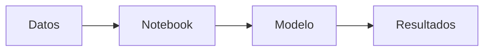
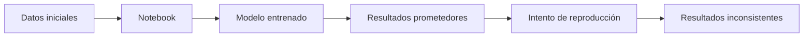
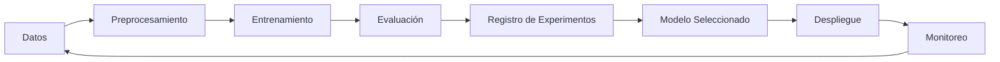

# 🧭 Unidad 1: Panorama de MLOps

## 🔍 ¿Qué es MLOps?

MLOps (Machine Learning Operations) es un conjunto de prácticas que busca integrar:

* **Ciencia de datos**
* **Ingeniería de software**
* **DevOps**

con el objetivo de construir sistemas de Machine Learning que sean:

* reproducibles,
* escalables,
* mantenibles,
* y colaborativos.

---

## ⚠️ El problema tradicional

En muchos proyectos de ciencia de datos, el flujo típico es el siguiente:

Este enfoque funciona en etapas exploratorias, pero presenta limitaciones críticas:

* el código no está estructurado;
* los datos no están versionados;
* los experimentos no son trazables;
* los resultados no son reproducibles;
* no hay colaboración organizada.

👉 En resumen: **el modelo funciona, pero el proceso no.**

---

## 🚨 Cuando intentamos escalar

Cuando este modelo se intenta llevar a producción, el flujo se rompe:

Esto ocurre porque:

* no sabemos qué versión de los datos se usó;
* no conocemos los parámetros exactos;
* el entorno no es replicable;
* no existe un pipeline definido.

---

## 🧠 El cambio de mentalidad

MLOps propone un cambio fundamental:

> ❗ Pasar de construir modelos a construir sistemas.

Esto implica pensar en:

* flujos de trabajo completos;
* control de versiones;
* trazabilidad;
* automatización;
* colaboración.

---

## 🔄 Flujo MLOps (visión general)

Un flujo típico de MLOps se ve así:

Este flujo introduce elementos clave:

* ciclo continuo;
* retroalimentación;
* control en cada etapa.

---

## 🧩 Componentes clave de MLOps

### 🔹 1. Versionamiento de código

Permite:

* rastrear cambios;
* colaborar en equipo;
* evitar sobrescrituras.

👉 Herramienta: **Git / GitHub**

---

### 🔹 2. Gestión de entornos

Permite:

* reproducir ejecuciones;
* evitar conflictos de dependencias;
* garantizar consistencia.

👉 Herramienta: **Poetry**

---

### 🔹 3. Versionamiento de datos

Permite:

* saber qué datos se usaron;
* reproducir experimentos;
* manejar datasets grandes.

👉 Herramienta: **DVC**

---

### 🔹 4. Tracking de experimentos

Permite:

* comparar modelos;
* registrar métricas;
* guardar artefactos.

👉 Herramienta: **MLflow**

---

## ⚖️ Data Science vs MLOps

| Aspecto          | Enfoque tradicional      | Enfoque MLOps           |
| ---------------- | ------------------------ | ----------------------- |
| Código           | Notebooks aislados       | Proyectos estructurados |
| Datos            | Sin control de versiones | Versionados             |
| Experimentos     | Manuales                 | Registrados             |
| Reproducibilidad | Baja                     | Alta                    |
| Colaboración     | Limitada                 | Estructurada            |
| Escalabilidad    | Difícil                  | Natural                 |

---

## 🧪 Ejemplo conceptual

### 🔴 Enfoque tradicional

Un científico de datos:

* carga datos localmente;
* entrena un modelo;
* guarda resultados manualmente.

Problemas:

* nadie más puede reproducirlo;
* si cambia el dataset, no hay trazabilidad;
* si el modelo mejora, no hay historial.

---

### 🟢 Enfoque MLOps

El equipo:

* versiona el código;
* versiona los datos;
* define pipelines;
* registra experimentos;
* documenta el proceso.

Resultado:

* cualquier persona puede replicar el flujo;
* los resultados son auditables;
* el sistema puede escalar.

---

## 🔗 Conexión con este módulo

En este módulo aprenderás a implementar este flujo usando:

* Git → control de versiones
* Poetry → entornos reproducibles
* DVC → datos y pipelines
* MLflow → experimentos

Pero más importante aún:

> 💡 aprenderás a integrarlos en un sistema coherente.

---

## 🚀 Lo que viene a continuación

En la siguiente sección profundizaremos en:

👉 el **ciclo de vida completo de un modelo de Machine Learning**

y cómo cada etapa se conecta con prácticas de MLOps.

---

## 🎯 Idea clave para llevar

> ❗ Un modelo no es el final del proceso.
> 👉 Es solo una pieza dentro de un sistema mucho más grande.

---
