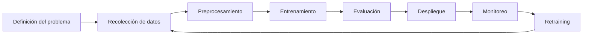
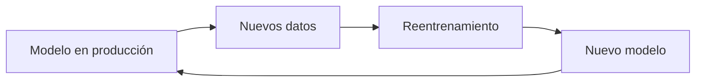

# 🔄 Unidad 2: Ciclo de Vida de un Modelo de Machine Learning

## 🌍 Más allá del entrenamiento

En muchos contextos académicos, el desarrollo de un modelo de Machine Learning se presenta como un proceso que termina cuando se obtienen buenas métricas.

Sin embargo, en entornos reales, esta visión es incompleta.

> ❗ Un modelo no termina cuando se entrena.
> 👉 En realidad, ahí es donde comienza su ciclo de vida.

---

## 🧠 ¿Qué es el ciclo de vida de un modelo?

El ciclo de vida de un modelo de Machine Learning describe todas las etapas necesarias para:

* construir,
* validar,
* desplegar,
* monitorear,
* y mantener un modelo en producción.

Este proceso no es lineal, sino **iterativo**.

---

## 🔄 Flujo general del ciclo de vida

Este flujo muestra que:

* el modelo evoluciona con el tiempo;
* los datos cambian;
* las decisiones deben adaptarse continuamente.

---

## 🧩 Etapas del ciclo de vida

A continuación, se describen las principales etapas del ciclo de vida, utilizando como referencia el caso de estudio de **predicción del tiempo de permanencia (`session_minutes`)**.

---

## 1️⃣ Definición del problema

### 🎯 Pregunta de negocio

> ¿Podemos predecir cuánto tiempo permanecerá un usuario en la plataforma?

### 🔍 Implicaciones

* definición de la variable objetivo;
* identificación de variables relevantes;
* entendimiento del contexto del negocio.

### ⚠️ Riesgos

* mal planteamiento del problema;
* métricas mal alineadas con el objetivo de negocio.

---

## 2️⃣ Recolección de datos

### 📊 Fuentes posibles

* logs de navegación;
* historial de sesiones;
* datos de usuario;
* eventos de interacción.

### ⚠️ Retos

* datos incompletos;
* inconsistencias;
* latencia en la actualización.

---

## 3️⃣ Preprocesamiento

### 🔧 Actividades

* limpieza de datos;
* imputación de valores faltantes;
* transformación de variables;
* encoding de variables categóricas.

### 💡 En el notebook anterior

* uso de `SimpleImputer`;
* uso de `OneHotEncoder`;
* estandarización con `StandardScaler`.

---

## 4️⃣ Entrenamiento del modelo

### 🤖 Ejemplo en este módulo

* modelo de regresión lineal;
* posible extensión a modelos más complejos.

### ⚠️ Consideraciones

* selección de variables;
* overfitting;
* elección de hiperparámetros.

---

## 5️⃣ Evaluación

### 📏 Métricas utilizadas

* MAE (error absoluto medio);
* RMSE (error cuadrático medio);
* R² (coeficiente de determinación).

### 🎯 Pregunta clave

> ¿El modelo realmente agrega valor al negocio?

---

## 6️⃣ Despliegue

### 🚀 ¿Qué significa desplegar?

Integrar el modelo en un sistema real para que genere predicciones automáticamente.

### Ejemplos

* API de predicción;
* integración en un sistema de recomendación;
* uso en tiempo real o batch.

---

## 7️⃣ Monitoreo

Una vez desplegado, el modelo debe ser monitoreado constantemente.

### 📉 ¿Qué se monitorea?

* desempeño del modelo;
* distribución de variables;
* drift en los datos;
* estabilidad de predicciones.

### ⚠️ Problema clave

> Un modelo bueno hoy puede ser malo mañana.

---

## 8️⃣ Retraining (reentrenamiento)

Cuando el modelo pierde desempeño:

* se recolectan nuevos datos;
* se reentrena;
* se valida nuevamente;
* se redepliega.

---

## 🔁 Naturaleza iterativa

El ciclo de vida no termina nunca:

---

## ⚖️ Enfoque tradicional vs enfoque MLOps

| Etapa           | Enfoque tradicional | Enfoque MLOps |
| --------------- | ------------------- | ------------- |
| Datos           | Manuales            | Versionados   |
| Entrenamiento   | Notebook            | Pipeline      |
| Evaluación      | Manual              | Registrada    |
| Despliegue      | Ad-hoc              | Automatizado  |
| Monitoreo       | Inexistente         | Continuo      |
| Reentrenamiento | Ocasional           | Sistemático   |

---

## 🧠 Conexión con MLOps

Cada etapa del ciclo de vida se conecta con herramientas específicas:

| Etapa        | Herramienta |
| ------------ | ----------- |
| Código       | Git         |
| Entorno      | Poetry      |
| Datos        | DVC         |
| Experimentos | MLflow      |

---

## 🧪 Aplicación al caso de estudio

En este módulo:

* partimos de un notebook exploratorio;
* estructuramos el proyecto;
* versionamos datos;
* registramos experimentos;
* y construimos un flujo reproducible.

---

## 🎯 Idea clave

> 💡 Un modelo de Machine Learning no es un producto terminado,
> es un sistema vivo que evoluciona con los datos.

---

## 🚀 Lo que sigue

En la siguiente unidad comenzaremos a construir:

👉 un pipeline estructurado para este problema

y veremos cómo pasar de código experimental a código reutilizable.

---
